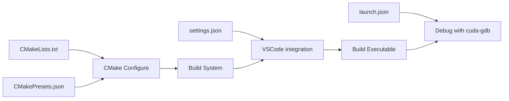

# ⚙️ Part 2: Your First CUDA Kernel

**Goal**: Introduce kernel syntax, compilation, launch, and debugging in VSCode.

---

## **2.1 Host vs Device Code Separation**

CUDA functions are separated by **execution location** and **call origin**:

| Qualifier      | Executes On | Callable From | Description |
|----------------|-------------|----------------|-------------|
| `__host__`     | CPU         | CPU            | Default for all C/C++ functions |
| `__device__`   | GPU         | GPU            | Used for helper functions inside kernels |
| `__global__`   | GPU         | CPU            | Defines a kernel callable from the host |

You use:
- `__global__` for launching kernels
- `__device__` for GPU-side helper logic

---

## **2.2 `__global__`, `__device__`, and `dim3` API**

#### ✅ `__global__` Kernel
Callable from host, executed on GPU:
```cpp
__global__ void myKernel(...) { ... }
````

#### ✅ `__device__` Function

Helper function usable **only** inside other device functions:

```cpp
__device__ float square(float x) {
    return x * x;
}
```

#### ✅ `dim3`: 1D/2D/3D Thread Organization

CUDA provides the `dim3` type to specify grid/block dimensions cleanly:

```cpp
dim3 blockDim(16, 16);  // 16x16 threads
dim3 gridDim((width+15)/16, (height+15)/16);
myKernel<<<gridDim, blockDim>>>(...);
```

You can access:

* `threadIdx.x`, `threadIdx.y`
* `blockIdx.x`, `blockIdx.y`
* `blockDim.x`, `blockDim.y`

This helps map GPU threads to 2D/3D data like images or matrices.

---

## **2.3 Launch Configuration with `dim3`**

Let’s use `dim3` to process data in 2D:

```cpp
// Launching a 2D grid of 16x16 blocks with 16x16 threads each
dim3 threadsPerBlock(16, 16);
dim3 blocksPerGrid((width + 15)/16, (height + 15)/16);

kernel2D<<<blocksPerGrid, threadsPerBlock>>>(...);
```

Inside the kernel, get your coordinates like this:

```cpp
int x = blockIdx.x * blockDim.x + threadIdx.x;
int y = blockIdx.y * blockDim.y + threadIdx.y;
```

---

## **2.4 CUDA Memory Management APIs**

Before diving into the example, let's understand the key CUDA APIs for memory management:

### **2.4.1 Memory Allocation & Transfer APIs**

| API Function | Description | Example |
|--------------|-------------|---------|
| `cudaMalloc()` | Allocates memory on GPU device | `cudaMalloc(&d_ptr, size)` |
| `cudaMemcpy()` | Copies data between host and device | `cudaMemcpy(dst, src, size, direction)` |
| `cudaFree()` | Frees GPU memory | `cudaFree(d_ptr)` |

### **2.4.2 cudaMemcpy Direction Flags**

| Flag | Direction | Usage |
|------|-----------|-------|
| `cudaMemcpyHostToDevice` | CPU → GPU | Upload input data |
| `cudaMemcpyDeviceToHost` | GPU → CPU | Download results |
| `cudaMemcpyDeviceToDevice` | GPU → GPU | Copy between GPU buffers |

### **2.4.3 Kernel Launch Syntax**

```cpp
kernelName<<<gridDim, blockDim>>>(args);
```

- **gridDim**: Number of blocks in the grid (can be dim3 for 2D/3D)
- **blockDim**: Number of threads per block (can be dim3 for 2D/3D)
- **args**: Arguments passed to the kernel function

### **2.4.4 Built-in Variables (Available in Kernels)**

| Variable | Description |
|----------|-------------|
| `threadIdx.x/y/z` | Thread index within block |
| `blockIdx.x/y/z` | Block index within grid |
| `blockDim.x/y/z` | Dimensions of block |
| `gridDim.x/y/z` | Dimensions of grid |

---

## **2.5 Complete Vector Add Example**

### **2.5.1 Full Code with Explanations**

```cpp
// vector_add_2d.cu
#include <iostream>
#include <cuda_runtime.h>

// Device function: runs on GPU, callable only from GPU
__device__ float square(float x) {
    return x * x;
}

// Kernel function: runs on GPU, callable from CPU
__global__ void vectorAdd2D(const float* A, const float* B, float* C, int width, int height) {
    // Calculate global thread position in 2D grid
    int x = blockIdx.x * blockDim.x + threadIdx.x;
    int y = blockIdx.y * blockDim.y + threadIdx.y;
    
    // Convert 2D position to 1D array index
    int i = y * width + x;

    // Boundary check to prevent out-of-bounds access
    if (x < width && y < height) {
        // Each thread computes one element: C[i] = A[i]² + B[i]
        C[i] = square(A[i]) + B[i];
    }
}

int main() {
    // Define problem size: 1024x1024 = 1,048,576 elements
    int width = 1024;
    int height = 1024;
    int N = width * height;
    size_t size = N * sizeof(float);

    // Step 1: Allocate host (CPU) memory
    float *h_A = (float*)malloc(size);  // h_ prefix = host memory
    float *h_B = (float*)malloc(size);
    float *h_C = (float*)malloc(size);

    // Step 2: Initialize input data on host
    for (int i = 0; i < N; ++i) {
        h_A[i] = static_cast<float>(i);      // A[i] = i
        h_B[i] = static_cast<float>(2 * i);  // B[i] = 2*i
    }

    // Step 3: Allocate device (GPU) memory
    float *d_A, *d_B, *d_C;  // d_ prefix = device memory
    cudaMalloc(&d_A, size);
    cudaMalloc(&d_B, size);
    cudaMalloc(&d_C, size);

    // Step 4: Copy input data from host to device
    cudaMemcpy(d_A, h_A, size, cudaMemcpyHostToDevice);
    cudaMemcpy(d_B, h_B, size, cudaMemcpyHostToDevice);

    // Step 5: Configure kernel launch parameters
    dim3 threads(16, 16);     // 256 threads per block (16x16)
    dim3 blocks((width + 15)/16, (height + 15)/16);  // Calculate grid size
    
    // Step 6: Launch kernel
    vectorAdd2D<<<blocks, threads>>>(d_A, d_B, d_C, width, height);

    // Step 7: Copy results back from device to host
    cudaMemcpy(h_C, d_C, size, cudaMemcpyDeviceToHost);

    // Step 8: Verify results
    std::cout << "C[0] = " << h_C[0] << std::endl;  // Should be 0² + 0 = 0
    std::cout << "C[1] = " << h_C[1] << std::endl;  // Should be 1² + 2 = 3

    // Step 9: Free memory
    cudaFree(d_A); cudaFree(d_B); cudaFree(d_C);
    free(h_A); free(h_B); free(h_C);
    
    return 0;
}
```

### **2.5.2 Key Concepts Demonstrated**

| Concept | Code Example | Purpose |
|---------|--------------|---------|
| **Device Function** | `__device__ float square()` | Helper function for GPU |
| **Kernel Function** | `__global__ void vectorAdd2D()` | Main GPU computation |
| **Thread Indexing** | `blockIdx.x * blockDim.x + threadIdx.x` | Global thread position |
| **2D to 1D Mapping** | `y * width + x` | Convert 2D coord to array index |
| **Grid Configuration** | `dim3 blocks((width+15)/16, ...)` | Calculate number of blocks |
| **Memory Transfer** | `cudaMemcpy(..., cudaMemcpyHostToDevice)` | Copy data to GPU |

### **2.5.3 Expected Output**

```
C[0] = 0
C[1] = 3
```

The computation for each element is: `C[i] = A[i]² + B[i]`
- C[0] = 0² + 0 = 0
- C[1] = 1² + 2 = 3
- C[2] = 2² + 4 = 8
- ...

---

## 🔨 2.6 Building and Running the Code

### **2.6.1 Building with VSCode (Recommended)**

#### **Quick Build with Keyboard Shortcuts**

1. **Configure CMake** (first time only):
   - Press `Ctrl+Shift+P` to open Command Palette
   - Type "CMake: Configure" and select it
   - Choose your preset (e.g., "default" for Debug build)
   
   

2. **Build the Project**:
   - Press `Ctrl+Shift+B` or `F7` to build
   - Or use Command Palette: `Ctrl+Shift+P` → "CMake: Build"
   
   

3. **Run without Debugging**:
   - Press `Ctrl+F5` to run
   - Or use Command Palette: `Ctrl+Shift+P` → "CMake: Run Without Debugging"

4. **Debug the Program**:
   - Press `F5` to start debugging
   - Set breakpoints by clicking on line numbers
   
   

#### **VSCode Status Bar Controls**

The bottom status bar provides quick access to:
- **Build Target**: Click to select which executable to build
- **Build Type**: Click to switch between Debug/Release
- **Build Button**: Click the "Build" text to compile
- **Run Button**: Click the play icon to run


### **2.6.2 Building with Command Line**

#### **Using CMake Commands**

```bash
# 1. Create build directory
mkdir -p build
cd build

# 2. Configure CMake (using default preset)
cmake --preset=default ..

# OR configure without preset
cmake -DCMAKE_BUILD_TYPE=Debug ..

# 3. Build the project
cmake --build .

# OR use ninja directly
ninja  # if using Ninja

# 4. Run the executable
./10.cuda_basic/12.Your\ First\ CUDA\ Kernel/12_YourFirstCUDAKernel
```

#### **Using CMake Presets from CLI**

```bash
# List available presets
cmake --list-presets

# Configure with specific preset
cmake --preset=default        # Debug with system compiler
cmake --preset=default-clang   # Debug with Clang
cmake --preset=release         # Release build

# Build with preset
cmake --build --preset=default
```

#### **Direct NVCC Compilation (Simple Projects)**

For quick testing without CMake:

```bash
# Compile with debug symbols
nvcc -G -g vector_add_2d.cu -o vector_add

# Compile with optimizations
nvcc -O3 vector_add_2d.cu -o vector_add

# Run the program
./vector_add
```

### **2.6.3 Build Output Structure**

After building, your directory structure will look like:

```
build/
├── CMakeCache.txt
├── CMakeFiles/
├── compile_commands.json  # For IntelliSense
├── 10.cuda_basic/
│   └── 12.Your First CUDA Kernel/
│       └── 12_YourFirstCUDAKernel  # Executable
└── ...
```

---

## 🛠️ 2.7 VSCode Setup and Configuration

#### ✅ Step 2.7.1: Install Required Extensions

* [x] CUDA Nsight for VSCode
* [x] CMake Tools (if using CMake)
* [x] C/C++ IntelliSense by Microsoft

---

#### ✅ Step 2.7.2: VSCode Folder Structure

```
.vscode/
├── launch.json
├── settings.json
CMakePresets.json
CMakeLists.txt
10.cuda_basic/
└── 12.Your First CUDA Kernel/
    ├── CMakeLists.txt
    └── vector_add_2d.cu
```

---

#### ✅ Step 2.7.3: `settings.json` (VSCode settings)

**What this file does:**
- Configures VSCode workspace settings specific to this CUDA project
- Integrates CMake build system with VSCode
- Sets up proper language support for CUDA files
- Ensures IntelliSense works correctly with CUDA code

**Key settings explained:**
- `cmake.configureArgs`: Arguments passed to CMake during configuration
- `cmake.buildDirectory`: Specifies where compiled binaries are placed
- `C_Cpp.default.configurationProvider`: Links IntelliSense to CMake for accurate code completion
- `files.associations`: Maps CUDA file extensions to proper syntax highlighting

```json
{
    "cmake.configureArgs": [
        "-DCMAKE_BUILD_TYPE=Debug",
        "-DCMAKE_EXPORT_COMPILE_COMMANDS=ON"
    ],
    "cmake.buildDirectory": "${workspaceFolder}/build",
    "C_Cpp.default.configurationProvider": "ms-vscode.cmake-tools",
    "files.associations": {
        "*.cu": "cuda-cpp",
        "*.cuh": "cuda-cpp"
    }
}
```

---

#### ✅ Step 2.7.4: `launch.json` (debug configurations)

**What this file does:**
- Defines how to debug CUDA programs in VSCode
- Configures NVIDIA's cuda-gdb debugger integration
- Enables GPU kernel debugging with breakpoints
- Supports both regular debugging and unit test debugging

**Key configuration options:**
- `type: "cuda-gdb"`: Uses NVIDIA's CUDA debugger
- `program`: Path to executable (dynamically resolved by CMake)
- `debuggerPath`: Location of cuda-gdb binary on your system
- `breakOnLaunch`: Whether to pause at program start
- `onAPIError`: Breaks execution when CUDA API errors occur

```json
{
  "version": "0.2.0",
  "configurations": [
    {
      // GPU kernel debugging on Linux/WSL via Nsight VS Code (cuda-gdb)
      "name": "CUDA C++: Launch (cuda-gdb)",
      "type": "cuda-gdb",
      "request": "launch",
      "program": "${command:cmake.launchTargetPath}",
      "args": [],
      "cwd": "${workspaceFolder}",
      // Change it to local cuda-gdb
      "linux": {
        "debuggerPath": "/usr/bin/cuda-gdb"
      },
      "breakOnLaunch": false,
      "onAPIError": "stop"
    },
    {
      // GPU kernel Unit Test debugging on Linux/WSL via Nsight VS Code (cuda-gdb)
      "name": "CUDA C++: CTest Launch (cuda-gdb)",
      "type": "cuda-gdb",
      "request": "launch",
      "program": "${cmake.testProgram}",
      "args": ["${cmake.testArgs}" ],
      "cwd": "${cmake.testWorkingDirectory}",
      // Change it to local cuda-gdb
      "linux": {
        "debuggerPath": "/usr/bin/cuda-gdb"
      },
      "breakOnLaunch": false,
      "onAPIError": "stop"
    }
  ]
}
```

---

#### ✅ Step 2.7.5: `CMakePresets.json` (Build Presets)

**What this file does:**
- Defines reusable build configurations for different scenarios (debug, release, different compilers)
- Eliminates the need to manually specify CMake options each time
- Integrates with VSCode's CMake Tools extension for easy preset switching
- Ensures consistent build settings across team members

**Key components:**
- `configurePresets`: Defines how CMake configures the project
- `generator`: Build system to use (Ninja, Make, Visual Studio, etc.)
- `binaryDir`: Where build files and executables are created
- `cacheVariables`: CMake variables like build type, compiler choices, and flags

You can select build preset in bottom bar of VSCode or via command palette:

> `CMake: Select Build Preset`

Available presets:

```json
{
    "version": 3,
    "configurePresets": [
        {
            "name": "default",
            "displayName": "Default Config",
            "description": "Default build using Ninja",
            "generator": "Ninja",
            "binaryDir": "${sourceDir}/build",
            "cacheVariables": {
                "CMAKE_BUILD_TYPE": "Debug",
                "CMAKE_EXPORT_COMPILE_COMMANDS": "ON"
            }
        },
        {
            "name": "default-clang",
            "displayName": "Default Config (Clang)",
            "description": "Default build using Ninja and Clang for C++",
            "generator": "Ninja",
            "binaryDir": "${sourceDir}/build-clang",
            "cacheVariables": {
                "CMAKE_C_COMPILER": "clang",
                "CMAKE_CXX_COMPILER": "clang++",
                "CMAKE_CUDA_COMPILER": "nvcc",
                "CMAKE_CUDA_HOST_COMPILER": "clang++",
                "CMAKE_CUDA_FLAGS": "-ccbin=clang++", 
                "CMAKE_BUILD_TYPE": "Debug",
                "CMAKE_EXPORT_COMPILE_COMMANDS": "ON"
            }
        },
        {
            "name": "release",
            "displayName": "Release Config",
            "description": "Release build using Ninja",
            "generator": "Ninja",
            "binaryDir": "${sourceDir}/build-release",
            "cacheVariables": {
                "CMAKE_BUILD_TYPE": "Release",
                "CMAKE_EXPORT_COMPILE_COMMANDS": "ON"
            }
        }
    ]
}
```

---

#### ✅ Step 2.7.6: `CMakeLists.txt` (Project Build Configuration)

The CMakeLists.txt file in the project folder:

```cmake
project(12_YourFirstCUDAKernel)
add_executable(${PROJECT_NAME} vector_add_2d.cu)
```

This simple CMake configuration:
- Creates a project named `12_YourFirstCUDAKernel`
- Builds an executable from `vector_add_2d.cu`
- CMake automatically detects CUDA and uses nvcc compiler

---

## 📁 2.8 Configuration Files Explained

### **2.8.1 `.vscode/settings.json`** - VSCode Workspace Configuration
Configures how VSCode handles the CUDA project:

| Setting | Purpose |
|---------|---------|
| `cmake.configureArgs` | Passes Debug mode and compile commands export to CMake |
| `cmake.buildDirectory` | Sets build output to `${workspaceFolder}/build` |
| `C_Cpp.default.configurationProvider` | Uses CMake Tools for IntelliSense configuration |
| `files.associations` | Maps `*.cu` and `*.cuh` files to CUDA C++ language mode |

### **2.8.2 `.vscode/launch.json`** - Debug Configurations
Defines two debug configurations:

1. **CUDA C++: Launch (cuda-gdb)**
   - Regular CUDA program debugging
   - Uses `${command:cmake.launchTargetPath}` to run CMake-built executable
   - Breaks on CUDA API errors with `onAPIError: "stop"`

2. **CUDA C++: CTest Launch (cuda-gdb)**
   - For debugging unit tests
   - Uses `${cmake.testProgram}` for test executables
   - Passes test arguments via `${cmake.testArgs}`

### **2.8.3 `CMakePresets.json`** - Build Presets
Provides three build configurations:

| Preset | Compiler | Build Type | Output Directory |
|--------|----------|------------|------------------|
| `default` | System default | Debug | `build/` |
| `default-clang` | Clang/LLVM | Debug | `build-clang/` |
| `release` | System default | Release | `build-release/` |

### **2.8.4 How They Work Together**



1. **Build Process**: CMake reads `CMakeLists.txt` and selected preset to generate build files
2. **VSCode Integration**: `settings.json` connects VSCode to CMake build system
3. **Compilation**: Build system compiles `.cu` files with nvcc
4. **Debugging**: `launch.json` configurations run cuda-gdb on the built executable

---

## 🔧 2.9 Troubleshooting Common Issues

### **2.9.1 Build Errors**

| Error | Cause | Solution |
|-------|-------|----------|
| `nvcc: command not found` | CUDA toolkit not installed or not in PATH | Add `/usr/local/cuda/bin` to PATH |
| `CMake Error: CMAKE_CUDA_COMPILER not found` | CMake can't find nvcc | Set `CMAKE_CUDA_COMPILER=/usr/local/cuda/bin/nvcc` |
| `undefined reference to cudaMalloc` | Not linking CUDA runtime | Add `-lcudart` to link flags |
| `unsupported gpu architecture` | GPU compute capability mismatch | Check GPU with `nvidia-smi` and set correct `-arch` flag |

### **2.9.2 Runtime Errors**

| Error | Cause | Solution |
|-------|-------|----------|
| `no CUDA-capable device is detected` | No GPU or driver issue | Check `nvidia-smi`, install/update drivers |
| `out of memory` | GPU memory exhausted | Reduce problem size or free unused memory |
| `unspecified launch failure` | Kernel crash (often array bounds) | Add boundary checks, use cuda-memcheck |
| `invalid device function` | Architecture mismatch | Recompile with correct compute capability |

### **2.9.3 VSCode Issues**

**IntelliSense not working for CUDA:**
- Ensure `files.associations` in settings.json maps `.cu` to `cuda-cpp`
- Check that CMake Tools extension is installed
- Verify `compile_commands.json` exists in build directory

**Debugger not stopping at breakpoints:**
- Ensure code is compiled with `-G` flag for debug symbols
- Check that you're using Debug build configuration
- Verify breakpoint is in device code, not host code

**CMake configuration fails:**
- Check that CUDA toolkit is installed: `nvcc --version`
- Ensure CMakeLists.txt has `project(name LANGUAGES CUDA CXX)`
- Try manually setting: `cmake -DCMAKE_CUDA_COMPILER=/usr/local/cuda/bin/nvcc`

### **2.9.4 Performance Issues**

**Kernel runs slower than expected:**
- Check if you're using Debug build (use Release for performance)
- Verify grid/block dimensions are appropriate
- Use `nvidia-smi` to monitor GPU utilization
- Profile with `nvprof` or Nsight Systems

---

### 🧠 2.10 API Recap

| API / Feature     | Description                              |
| ----------------- | ---------------------------------------- |
| `__global__`      | GPU kernel callable from host            |
| `__device__`      | GPU-only helper functions                |
| `dim3`            | Grid/block configuration type            |
| `cudaMalloc`      | Allocates GPU memory                     |
| `cudaMemcpy`      | Transfers memory between host and device |
| `cudaFree`        | Frees GPU memory                         |

---

### ✅ 2.11 Summary

* You learned to write your first kernel using `__global__` and `__device__`
* `dim3` helps organize threads for 2D and 3D data
* CUDA memory management with `cudaMalloc`, `cudaMemcpy`, and `cudaFree`
* VSCode integration using CMake and configuration files
* Build configurations with CMakePresets.json for different scenarios

📄 Next: **Part 3 – Debugging CUDA in VSCode**
